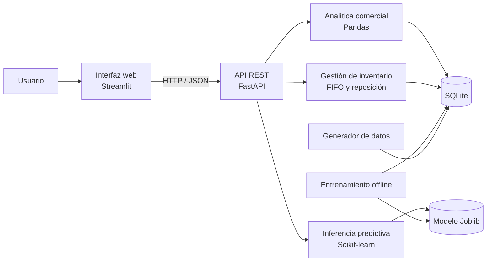

# Inteligencia comercial para venta de repuestos

Plataforma web para analizar ventas de repuestos automotrices y estimar las unidades del próximo mes. Centraliza indicadores comerciales, rankings de productos, compatibilidad vehicular, evolución mensual y predicciones en una interfaz orientada a la toma de decisiones.

La solución incluye un conjunto de datos sintéticos y reproducibles para ejecutar el sistema de forma local. Estos datos permiten explorar todas las funciones sin conectarse a sistemas comerciales ni utilizar información sensible.

## Funcionalidades

- Resumen de unidades vendidas, ingresos, costo vendido y margen bruto estimado.
- Ranking de productos por unidades o ingresos.
- Filtros por período, producto, marca y modelo vehicular compatible.
- Identificación de productos de alta, baja o nula rotación.
- Control de existencias, antigüedad, mercancía lenta y quiebres de stock.
- Capital inmovilizado, costo estimado de almacenamiento y alertas de vencimiento o merma.
- Punto de reorden y cantidad sugerida mediante demanda histórica, plazo de proveedor y stock de seguridad.
- Evolución mensual y comparación interanual.
- Predicción de unidades para el siguiente mes por producto.
- Comparación del modelo predictivo con una referencia basada en el promedio móvil de tres meses.
- API REST documentada para integrar los datos y predicciones con otros consumidores.

## Arquitectura

La aplicación utiliza una arquitectura local por capas. La interfaz Streamlit consume exclusivamente la API FastAPI mediante HTTP. La API concentra las reglas de análisis, consulta SQLite y utiliza un modelo de Machine Learning previamente entrenado. La generación de datos y el entrenamiento se ejecutan como procesos independientes, nunca durante una solicitud web.



### Componentes

- `ui/app.py`: interfaz web y visualización de resultados.
- `src/repuestos/api.py`: endpoints REST, validación y manejo de errores.
- `src/repuestos/analytics.py`: filtros, agregaciones, indicadores y series mensuales.
- `src/repuestos/data.py`: generación, validación, respaldo y restauración de datos.
- `src/repuestos/ml.py`: preparación de variables, entrenamiento, evaluación e inferencia.
- `src/repuestos/settings.py`: rutas y configuración de ejecución.
- `data/`: base de datos SQLite generada localmente.
- `artifacts/`: modelo entrenado y métricas de evaluación.
- `tests/`: pruebas automatizadas de lógica, API e interfaz.

## Tecnologías

- Python 3.11 o superior
- Streamlit para la interfaz web
- FastAPI y Uvicorn para la API REST
- SQLite para persistencia local
- Pandas y NumPy para procesamiento y análisis
- Scikit-learn para el modelo Random Forest
- Joblib para persistencia del modelo
- Pytest para pruebas automatizadas
- HTTPX para pruebas e integración HTTP

Las versiones verificadas se encuentran fijadas en `requirements.lock.txt`.

## Puesta en marcha

### 0. Instalar un intérprete de Python

Antes de crear el entorno virtual, instalar Python 3.11 o superior y asegurarse de que el comando `python` esté disponible en la terminal.

Comprobar la instalación con:

```powershell
python --version
```

### 1. Crear el entorno e instalar dependencias

Desde la raíz del proyecto, en PowerShell:

```powershell
python -m venv .venv
./.venv/Scripts/python.exe -m pip install -r requirements.lock.txt
./.venv/Scripts/python.exe -m pip install --no-deps --no-build-isolation -e .
```

En Linux o macOS, sustituir `.venv/Scripts/python.exe` por `.venv/bin/python`.

### 2. Preparar datos y modelo

```powershell
./.venv/Scripts/python.exe -m repuestos.data generate
./.venv/Scripts/python.exe -m repuestos.ml
```

El primer comando crea `data/demo.sqlite`. El segundo entrena el modelo y genera `artifacts/model.joblib` y `artifacts/metrics.json`.

### 3. Iniciar la API

```powershell
./.venv/Scripts/python.exe -m uvicorn repuestos.api:app --host 127.0.0.1 --port 8000
```

### 4. Iniciar la interfaz web

En otra terminal:

```powershell
./.venv/Scripts/python.exe -m streamlit run ui/app.py --server.address 127.0.0.1 --server.port 8501 --server.headless true
```

Servicios disponibles:

- Aplicación web: http://127.0.0.1:8501
- API REST: http://127.0.0.1:8000
- Documentación OpenAPI: http://127.0.0.1:8000/docs

Para detener los servicios, presionar `Ctrl+C` en cada terminal.

## Configuración

La ubicación de los recursos puede modificarse mediante variables de entorno:

| Variable | Descripción | Valor predeterminado |
|---|---|---|
| `REPUESTOS_DB` | Ruta de la base de datos SQLite | `data/demo.sqlite` |
| `REPUESTOS_MODEL` | Ruta del modelo entrenado | `artifacts/model.joblib` |
| `REPUESTOS_API` | URL utilizada por la interfaz para consumir la API | `http://127.0.0.1:8000` |

## API

| Método | Ruta | Descripción |
|---|---|---|
| `GET` | `/health` | Estado de disponibilidad de datos y modelo |
| `GET` | `/catalog` | Catálogo, vehículos y compatibilidades |
| `GET` | `/analytics/summary` | Indicadores comerciales filtrables |
| `GET` | `/analytics/ranking` | Ranking por unidades o ingresos |
| `GET` | `/analytics/monthly` | Evolución y comparación mensual |
| `GET` | `/inventory/overview` | Stock, rotación, quiebres, costos, reposición, vencimientos y mermas |
| `GET` | `/model/metrics` | Métricas del modelo y de la referencia |
| `POST` | `/predictions` | Predicción del próximo mes por producto |

Los parámetros, cuerpos de solicitud, respuestas y códigos de error se encuentran documentados en `/docs`.

## Pruebas

Ejecutar la suite automatizada:

```powershell
./.venv/Scripts/python.exe -m pytest -q
```

Con la API en ejecución, también están disponibles las verificaciones de integración y carga:

```powershell
./.venv/Scripts/python.exe scripts/check_ui.py
./.venv/Scripts/python.exe scripts/load_test.py
```

El recorrido visual automatizado requiere Playwright para Node.js:

```powershell
npm install
npx playwright install chromium
npm run check:browser
```

Los validadores guardan resultados regenerables en `output/evidence/`, una ruta local excluida del repositorio. Puede cambiarse con `REPUESTOS_EVIDENCE_DIR`. El recorrido de navegador también admite `REPUESTOS_UI`, `PLAYWRIGHT_MODULE` y `BROWSER_EXECUTABLE` para entornos personalizados.

## Respaldo y restauración

Detener la API y la interfaz antes de respaldar, regenerar o restaurar datos.

Crear un respaldo:

```powershell
./.venv/Scripts/python.exe -m repuestos.data backup --file backups/demo-01.sqlite
Copy-Item artifacts/model.joblib backups/model-01.joblib
Copy-Item artifacts/metrics.json backups/metrics-01.json
```

Restaurar datos y modelo:

```powershell
./.venv/Scripts/python.exe -m repuestos.data restore --file backups/demo-01.sqlite
Copy-Item backups/model-01.joblib artifacts/model.joblib
Copy-Item backups/metrics-01.json artifacts/metrics.json
```

La base de datos y el modelo deben mantenerse como una unidad coherente. Si se restaura únicamente la base de datos, se debe volver a ejecutar el entrenamiento antes de solicitar predicciones. El endpoint `/health` permite comprobar la disponibilidad y compatibilidad de ambos recursos.

## Consideraciones de uso

- La predicción estima ventas observadas; no calcula demanda no satisfecha ni cantidades óptimas de compra.
- El punto de reorden es una recomendación basada en parámetros visibles; no garantiza que no ocurran quiebres.
- El costo de almacenamiento es una estimación operativa con tasa configurable, no un asiento contable.
- Las diferencias de conteo requieren investigación y no se interpretan automáticamente como robo.
- El margen mostrado es bruto y no representa utilidad neta ni flujo de caja.
- Las compatibilidades vehiculares sirven para filtrar productos y no identifican el vehículo de una venta.
- Los modelos Joblib deben generarse dentro de un entorno controlado. No se deben cargar artefactos de origen desconocido.
